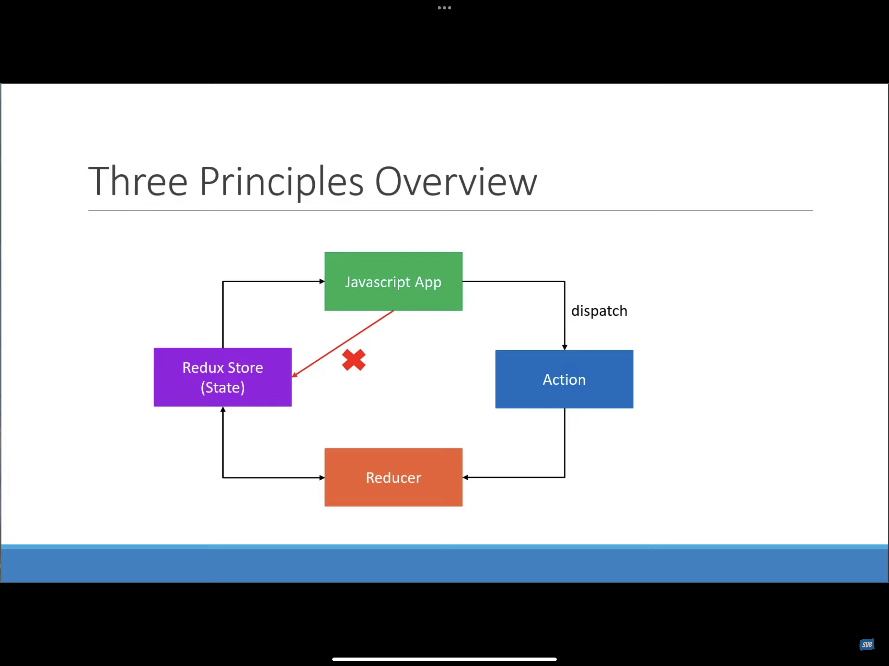

# Three Core Concepts

## Cake Shop

| Entities | Activities |
|-------------- | -------------- |
| Entity | Detail | Activity | Detail |
|-------------- | -------------- | -------------- |  ---------------- |
| Shop | Stores ckaes on a shelf | Customer | Order a cake |
| Shopkeeper | Behind the counter | Shopkeeper | Box a cake from the self |
| Customer | At the store entrance | Sale | Receipt to keep track |

### Three Core Concepts contd.

| Cake Shop Scenario | Redux | Purpose |
|-------------- | -------------- | -------------- |
| Shop | Store | Holds the state of your application |
| Cake | Action | Describes what happened |
| Shopkeeper | Reducer | Ties the store and actions together |

- A **store** that holds the state of your application.
- An **action** that describes what happened in the application.
- A **reducer** which handles the action and decides how to update the state.

### Three Principles

#### First Principle
> "The global of you application is stored as an object inside a single store."

Maintain our application state in a single object which would be managed by Redux store.

<u>Cake Shop</u>-

Let's assume we are tracking the number of cakes on the shelf.

```
{
    numberOfCakes: 10
}
```

#### Second Principle
> "The only way to change the state is to dispatch an action, an object that describes what happened"

To update the state of your app, you need to let Redux know about that with an action.
Not allowed to directly update the state object.

<u>Cake Shop</u>-

Scan the QR code and place an order - CAKE_ORDERED:

```
{
    numberOfCakes: 10
}
```

#### Third Principle
> "To specify how the state tree is updated based on actions, you write pure reducers."

Reducer - (previousState, action) => newState

<u>Cake Shop</u>

Reducer is the shopkeeper:

```
const reducer = (state = initialState, action) => {
    switch (action.type) {
      case CAKE_ORDERED:
        return {
          numberOfCakes: state.numberOfCakes - 1  
        }
    }
}
```

#### Three Principles Overview


## Actions
- The only way your application can interact with the store.
- Carry some information from your app to the Redux store.
- Plain JavaScript objects.
- Have a 'type' property that describes something that happened in the application.
- The 'type' property is typically defined as string constants.


